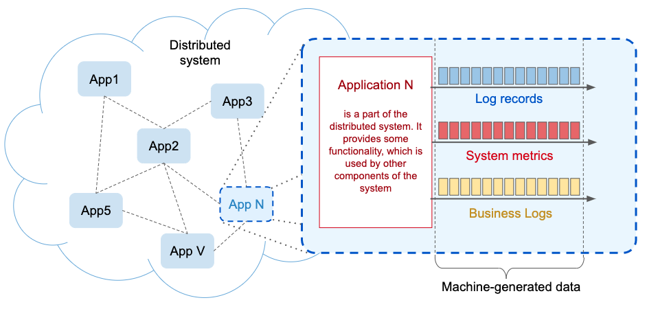
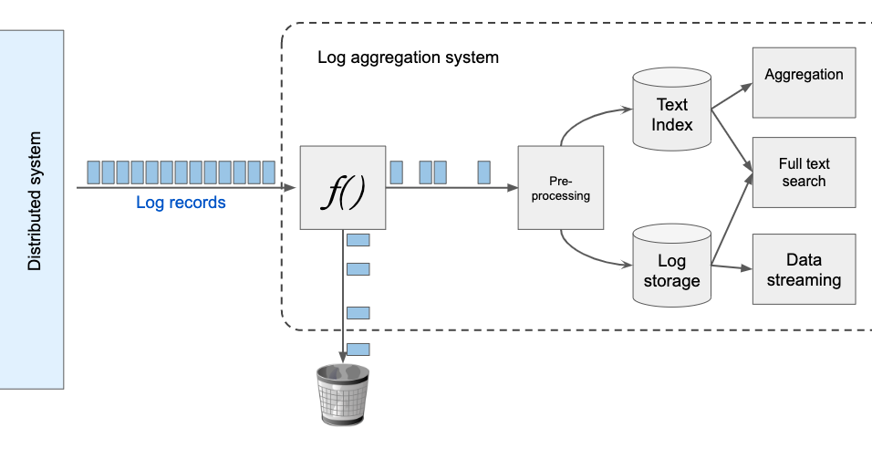
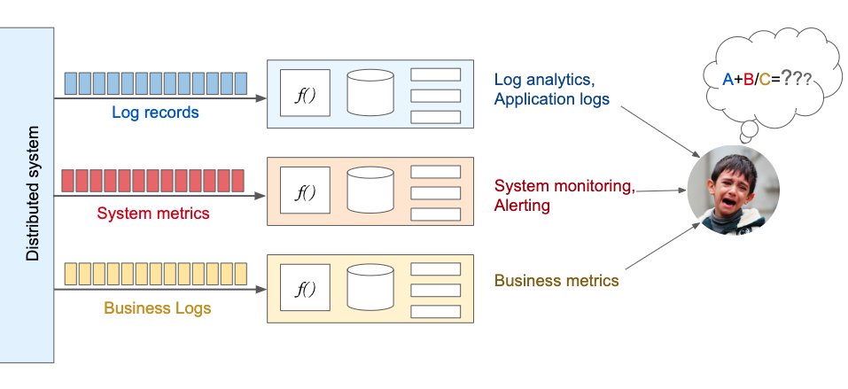
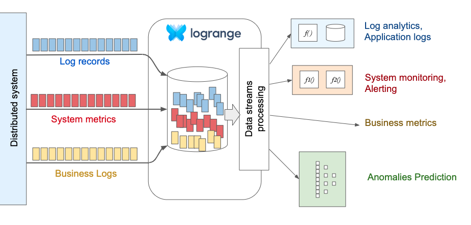

### What is Logrange?
[Logrange](https://github.com/logrange/logrange) is an open-source streaming database for aggregating application logs, metrics, audit logs and other machine-generated data from unlimited number of sources.

Logrange is built around the following ideas:
- Every piece of data is valuable
- Writing data is cheap no matter the amount
- One place to store all the data(logs, metrics, audit, etc.)
- Persisting first, processing later

There are number of cases where Logrange could be useful:
- Log data aggregation and search
- Metrics collecting
- Security alerting
- Anomalies prediction
- Incident investigation
- Hidden problems analysis
- etc.

Logrange is the game changer in distributed systems health and data analysis. Why? Let's try to look into some details.
 
### Distributed System health and its analysis
Modern distributed information systems consist of hundreds or even thousands of components (applications). Each of such components generates some information in a form of application logs. Also there are some metrics which can be monitored and recorded in real-time. The data is called machine-generated data and it has streaming nature.

The streaming data is generated continuously by thousands of data sources, which typically send in the data records simultaneously, and in small sizes. Despite of the fact that the records are small, due to the number of records the streaming data has very significant volume, which could be counted in hundreds of megabytes per second(!)

To make an analysis of the distributed system data we have to:
1. aggregate the machine-generated data 
2. analyze the aggregated data in accordance with a selected domain model.

### Data aggregation problem
Data aggregation could be a challenge due to the amount of the machine-generated data.

For example, most of log aggregating solutions offer powerful tools like full-text search, which requires data preprocessing (indexing). Data indexing is resource-costly process, so to make the tool be able to work at all, it is asked to reduce amount of the logs to be stored. The full-text search may be not needed at all, but the logs were cut because of the indexing cost. It doesn’t seem very reasonable...

> So, the common practice is to select "the most important" information, dropping "unnecessary" one due to cost of the information processing. 

This could make sense if the system is determined and methods of its analysis are known and clear. Unfortunately it is not true, the reality is different, so we are not absolutely sure whether the dropped information is unessential.

### Data analysis problem
On the market, there are plenty of tools that work with specific type of the streaming data. For example, some log aggregation solutions focus on collecting, indexing, persisting application logs providing such useful features like search. Another tools focus on working with system metrics. They collect, persist and handle the resources consumption metrics. Alerting on hitting some parameters threshold are very useful features.

All of these tools usually provide a "full-stack" functionality for some specific type of data (verticals). It includes data collecting, pre-processing, persisting and providing features to the end user. Such kind of approach complicates distributed system data analysis due to the data integration, which should be done by the end user between different data sources.

### What does Logrange offer?
Logrange is built to solve aforementioned problems. 

#### Persisting everything
Instead of trying to persist only "essential" (we actually never know) data, Logrange persists all the data. Having all the data persisted, different types of processing for different data subsets can be applied. This allows to apply countless methods of data analysis, building different models and gradually approach to understanding the system behavior. 

> The cost of saving the data is cheap, so if data is really not needed it could be removed anytime.

#### Working with different types of data (verticals)
Having all the data in one place gives an advantage because there is no problem with the data integration from different data sources. For example, Logrange can keep system metrics, application and business logs or any other metrics in its database. Using this approach such tasks like finding correlation between log messages and system metrics could be easily solved.

### Conclusion
Logrange strives to achieve the following goals:
- Persisting streaming data should be cheap. 
- Any machine-generated data could be persisted into one place.
- Building advanced analytical tools easily on top of the collected data.
- Being open-source and secure.
- Run everywhere either in Cloud or On-Premise configurations.
- Easy to run and configure.

Logrange allows to persist every machine-generated data in one place with the purpose to perform comprehensive analysis of the data afterwards.